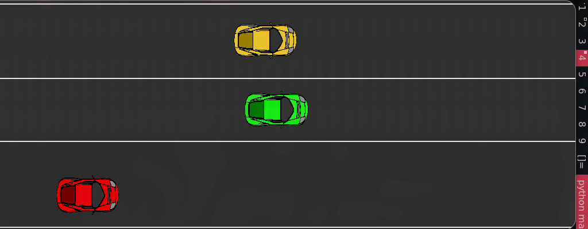

# HighWay Rider

training an autonomus highway car to decide lane swithing motion using pytorch and math . also render using pygame

## parts of the project

- [Brain](./Brain/) : helps in making decision and learning
- [GameEngine](./GameEngine/) : helps in rendering cars in different lanes and also move cars ( player and traffic ) . handles game logic

## outputs

- [Math](./math.pdf)
- **output**

  

## Dev Environment:

- ```
  python -m venv env
  ```

- **Linux**:
  ```
  source env/bin/activate
  ```
- **Windows**:

  ```
  cd enc/Scripts/ && ./activate && cd ../../
  ```

- **Install Requirements**

  ```
  pip install -r requirements.txt
  ```

- **Run**
  ```
  python main.py
  ```

## neural network structure

- **inputs** = [
  traffic_car1.x , traffic_car1.y .......traffic_car4.x,traffic_car4.y,player_car.x,player.y
  ] - > (5x2)
- **layers** = [
  linear(10 -> 16) -> relu() -> linear(16 -> 16) -> relu() -> linear(16 -> 3 ) -> softmax()
  ]

- **outputs** = probabilities([ left,stay,right ])

## mathematics

- linear-algebra
- calculus
- probability
